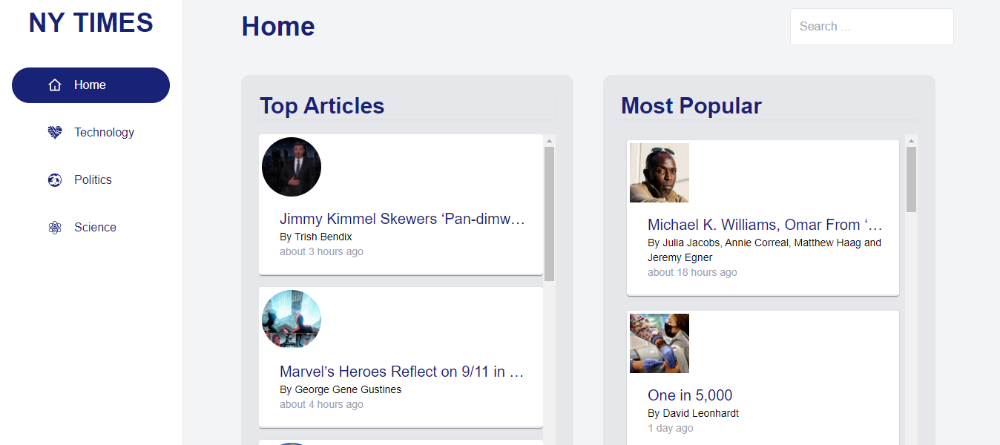
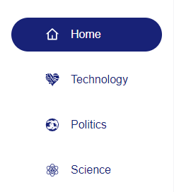
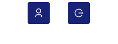

<br />
<p align="center">
  <h1 align="center">A News App</h1>
  
  <p align="center">
    A web-based News-Accessing application that delivers latest News instantaneously.
    <br /><br />
    <a href=""><strong>View Demo »</strong></a>
    <br /><br />
    <a href="">Report Bug</a>
    <a href="">Request Feature</a>
  </p>
</p>

<h2 style="display: inline-block">Table of Contents</h2>
<ol>
  <li>
    <a href="#about-the-project">About The Project</a>
    <ul>
      <li><a href="#built-with">Built With</a></li>
    </ul>
  </li>
  <li>
    <a href="#getting-started">Getting Started</a>
    <ul>
      <li><a href="#prerequisites">Prerequisites</a></li>
      <li><a href="#installation">Installation</a></li>
    </ul>
  </li>
  <li><a href="#usage">Usage</a></li>
</ol>


## About The Project

### Built With
* **[React](https://reactjs.org/)**
* **[Tailwindcss](https://socket.io/)**
* **[NYC Developer API](https://developer.nytimes.com/)**
* [Node.js](https://nodejs.org/en/)

## Getting Started
To get a local copy up and running follow these simple steps.


### Prerequisites
Install latest version of npm
* npm
  ```sh
  npm install npm@latest -g
  ```

### Installation
1. Clone the project
   ```sh
   git clone https://github.com/santosdave/news-letu-app.git
   ```
2. Go to project directory and Install NPM packages
   ```sh
   npm install
   ```
3. Start the application
   ```sh
   npm start
   ```

## Usage
**Creating an Account**


1. In the login page, click 'Register here'.
2. Input the necessary fields. Don't worry. It won't take long.
3. You'll be redirected to the login page. Enter your newly created credentials.
**NB/Authentication is yet to be implemented**


**View Categories Of News**


1. Click the News Category on the sidebar header.


**View User Information**


1. Click the User Icon on the sidebar header.

